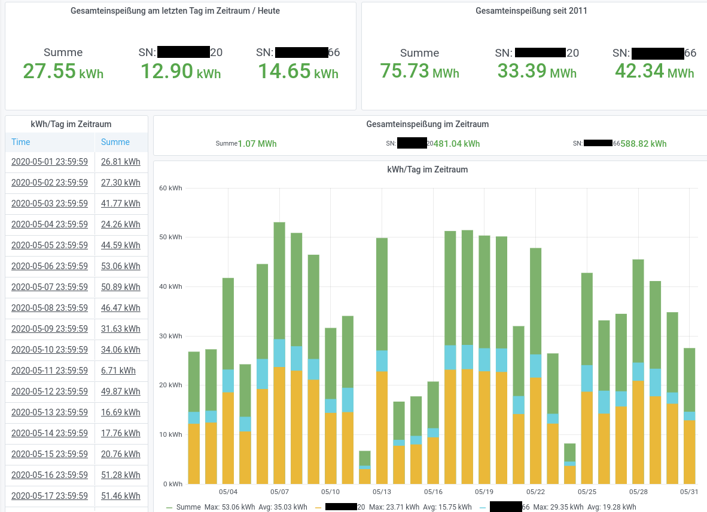

# SMA Solar Exporter

A prometheus exporter for SMA Solar inverters, written in Go.

To connect to SMA inverters the exporter makes use of [yasdi], which is provided by SMA.
The physical connection can be done via RS232, RS485 or Powerline.

[yasdi]: https://www.sma.de/en/products/monitoring-control/yasdi.html

## Usage

```
$ sma-solar-exporter -h
Usage of ./sma-solar-exporter:
  -influx-bucket string
        Bucket name (influx 2.x) or database/retention-policy (influx 1.8) or database (influx 1.8)
  -influx-org string
        Organization name (optional for influx 1.8)
  -influx-token string
        Token (influx 2.x) or username:password (influx 1.8) to authenticate with
  -influx-url string
        URL of InfluxDB server
  -metric-channels string
        A comma separated list of channel names which should get exposed as metric. (default "A.Ms.Amp,A.Ms.Vol,A.Ms.Watt,E-Total,GridMs.PhV.phsA,Mt.TotOpTmh,Mt.TotTmh,Pac")
  -metrics-addr string
        The address the metric endpoint binds to. (default ":8080")
  -yasdi-config string
        The path to the yasdi config file. (default "/etc/yasdi/yasdi.ini")
  -yasdi-devices int
        The number of inverters expected to get detected. (default 2)
  -yasdi-driver int
        The driver reference in yasdi-config to use.
```

## Configuration

The exporter needs a proper `yasdi.ini` file which configures how the yasdi library will talk to the inverter(s).
The following example is using a usb to serial adapter which is connected to the inverters.

```ini
[DriverModules]
Driver0=yasdi_drv_serial

# Configs for serial port 1
[COM1]
Device=/dev/ttyUSB0
Media=RS485
Baudrate=1200
Protocol=SMANet
```

## Installation

### Building from source

To build the exporter from source there are som requirements needed:
```sh
apt-get install -y golang-go build-essential curl unzip cmake
```

Afterwards the binary could be built via make:
```
make all
```

> **Note:** This will also create a directory called `yasdi` and fetch the necessary C Library.
> For details have a look at the `yasdi` target in [Makefile](Makefile).

## Exposed metrics

All metrics except `sma_scrape_duration_seconds` will have the following labels:
* `channel_name`: the original yasdi channel name
* `inverter_name`: the name of the inverter
* `serial`: the serial number of the inverter
* `unit`

The exporter exposes the following metrics:
```
# HELP sma_actual_power Delivered active power in W
# TYPE sma_actual_power gauge
# HELP sma_dc_current DC current in A
# TYPE sma_dc_current gauge
# HELP sma_dc_power DC power
# TYPE sma_dc_power gauge
# HELP sma_dc_voltage DC voltage in V
# TYPE sma_dc_voltage gauge
# HELP sma_feeding_energy_total Total amount of feeding-in energy in kWh
# TYPE sma_feeding_energy_total gauge
# HELP sma_feeding_hours_total Total number of grid-feeding operational hours
# TYPE sma_feeding_hours_total gauge
# HELP sma_grid_phase_voltage Grid voltage on phase in V
# TYPE sma_grid_phase_voltage gauge
# HELP sma_operating_hours_total Total number of operating hours of inverter
# TYPE sma_operating_hours_total gauge
# HELP sma_scrape_duration_seconds The time needed to scrape the plant
# TYPE sma_scrape_duration_seconds histogram
```

Example output from `cmd/exporter-simulation`:
```
sma_actual_power{channel_name="Pac",inverter_name="inverter 0",serial="0",unit="W"} 220
sma_actual_power{channel_name="Pac",inverter_name="inverter 1",serial="1",unit="W"} 220
sma_dc_current{channel_name="A.Ms.Amp",inverter_name="inverter 0",serial="0",unit="A"} 0.2
sma_dc_current{channel_name="A.Ms.Amp",inverter_name="inverter 1",serial="1",unit="A"} 0.2
sma_dc_power{channel_name="A.Ms.Watt",inverter_name="inverter 0",serial="0",unit="W"} 470.7999999999996
sma_dc_power{channel_name="A.Ms.Watt",inverter_name="inverter 1",serial="1",unit="W"} 470.7999999999996
sma_dc_voltage{channel_name="A.Ms.Vol",inverter_name="inverter 0",serial="0",unit="V"} 260.59999999999997
sma_dc_voltage{channel_name="A.Ms.Vol",inverter_name="inverter 1",serial="1",unit="V"} 260.59999999999997
sma_feeding_energy_total{channel_name="E-Total",inverter_name="inverter 0",serial="0",unit="kWh"} 10011
sma_feeding_energy_total{channel_name="E-Total",inverter_name="inverter 1",serial="1",unit="kWh"} 10011
sma_feeding_hours_total{channel_name="Mt.TotOpTmh",inverter_name="inverter 0",serial="0",unit="h"} 3000.0308000000023
sma_feeding_hours_total{channel_name="Mt.TotOpTmh",inverter_name="inverter 1",serial="1",unit="h"} 3000.0308000000023
sma_grid_phase_voltage{channel_name="GridMs.PhV.phsA",inverter_name="inverter 0",serial="0",unit="V"} 229.9699999999998
sma_grid_phase_voltage{channel_name="GridMs.PhV.phsA",inverter_name="inverter 1",serial="1",unit="V"} 229.9699999999998
sma_operating_hours_total{channel_name="Mt.TotTmh",inverter_name="inverter 0",serial="0",unit="h"} 2500.0308000000023
sma_operating_hours_total{channel_name="Mt.TotTmh",inverter_name="inverter 1",serial="1",unit="h"} 2500.0308000000023
sma_scrape_duration_seconds_bucket{le="0.005"} 23
sma_scrape_duration_seconds_bucket{le="0.01"} 23
sma_scrape_duration_seconds_bucket{le="0.025"} 23
sma_scrape_duration_seconds_bucket{le="0.05"} 23
sma_scrape_duration_seconds_bucket{le="0.1"} 23
sma_scrape_duration_seconds_bucket{le="0.25"} 23
sma_scrape_duration_seconds_bucket{le="0.5"} 23
sma_scrape_duration_seconds_bucket{le="1"} 23
sma_scrape_duration_seconds_bucket{le="2.5"} 23
sma_scrape_duration_seconds_bucket{le="5"} 23
sma_scrape_duration_seconds_bucket{le="10"} 23
sma_scrape_duration_seconds_bucket{le="+Inf"} 23
sma_scrape_duration_seconds_sum 0.0016648730000000003
sma_scrape_duration_seconds_count 23
```

## Grafana dashboard

There is also a [grafana dashboard].
It is used together with prometheus and [promshift-proxy] as [datasources].
Promshift is used to move the timestamps in prometheus queries to adjust fix the visualization of the data.



[grafana dashboard]: misc/grafana/dashboard.json
[promshift-proxy]: https://github.com/chrischdi/promshift-proxy
[datasources]: misc/grafana/datasources.json